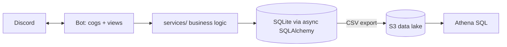

# Discord Attendance Bot

Production Discord bot that automates daily availability check-ins for a competitive
EA FC Pro Clubs team, plus an AWS analytics pipeline over the resulting attendance data.

## Problem

Coordinating nightly availability in Discord chat doesn't scale: captains chase people
individually, there's no lock-in before kickoff, and there's no record of who actually
shows up over time.

## Features

- Daily auto-posted check-in board (Available / Out), always rendered live from the database
- Automatic response locking before kickoff, plus manual captain lock/unlock
- Staged pre-kickoff reminders for non-responders
- Full response history persisted for attendance analytics
- S3 + Athena pipeline for ad-hoc SQL attendance analytics

## Architecture



## Tech Stack

- Python 3.12, discord.py
- Async SQLAlchemy 2.0 + aiosqlite
- APScheduler
- AWS EC2 (systemd), S3, Athena (EC2 IAM instance role — no static credentials)
- pytest / pytest-asyncio

## Engineering Decisions

- **Database as source of truth** — the check-in embed is always rendered from DB
  state, never in-memory, so concurrent button clicks can't desync the board.
- **Service-layer separation** — `services/` never imports `discord.py`, so business
  logic is unit-testable without a live bot connection.
- **Persistent views** — buttons use stable `custom_id`s re-registered in
  `setup_hook`, so they keep working across restarts and deploys.

## Testing

28 unit tests (pytest + pytest-asyncio), no live Discord connection required:

```bash
pytest -q
```

## Deployment

Runs 24/7 on a single AWS EC2 (Ubuntu) instance under `systemd`. See
[DEPLOY.md](DEPLOY.md) for the full setup and update workflow.

## Setup

```bash
python3.12 -m venv .venv
source .venv/bin/activate
pip install -r requirements-dev.txt
cp .env.example .env   # fill in your values
pytest -q
```

## Future Improvements

- Automate the nightly S3 export (currently a manual step)
- In-app `/attendance` command for ghost detection (members who never respond)
- Optional: partition S3 data by date, add a QuickSight dashboard
