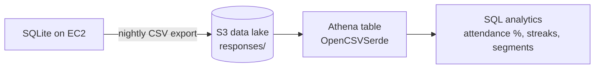

# Attendance Analytics

The bot persists every check-in response, which powers a **two-layer analytics design** —
a deliberate split between operational and analytical workloads (OLTP vs. OLAP).

| Layer | Where | Purpose | Status |
|---|---|---|---|
| **Operational** | In-app `/attendance` command (Discord) | Fast, private roster report the team uses for keep/cut decisions — reliable regulars, chronically unavailable, and non-participants ("ghosts") | Planned |
| **Analytical** | AWS **S3 + Athena** | Serverless data lake for ad-hoc SQL analytics and portfolio/BI reporting | **Implemented** |

Only the in-app layer can detect *ghosts* (server members who have never responded),
because the analytical export only contains people who have responded at least once — the
full member roster lives in Discord, not the database.

## Analytical pipeline (S3 + Athena)



Data flows from the bot's SQLite database on EC2 to an S3 bucket, which Athena queries
in place with standard SQL. The EC2 instance authenticates to S3 with an **IAM instance
role** (least-privilege, no access keys on disk).

### Design rationale

The dataset is tiny (a few dozen rows/day), so this is intentionally **batch + SQL**, not
streaming or a BI subscription. Athena and QuickSight would be over-engineered for the
volume — the pattern is built to demonstrate a scalable, credential-less serverless design
and a clear path to scale, while right-sizing for the actual workload. **Ongoing cost is
effectively $0** (S3 pennies; Athena bills per TB scanned with a 10 MB minimum — kilobytes
here; no QuickSight).

### Setup

1. **Export** the response data to CSV on the EC2 host:
   ```bash
   sqlite3 -header -csv proclubs.db "
   SELECT e.event_date, e.event_type, e.start_time AS kickoff,
          p.discord_id, p.display_name, r.state, r.position, r.created_at
   FROM responses r
   JOIN events e ON e.id = r.event_id
   JOIN players p ON p.id = r.player_id
   ORDER BY e.event_date;" > attendance.csv
   ```
2. **Bucket:** create a private S3 bucket, e.g. `s3://<bucket>/` (block public access on).
3. **IAM role:** attach an EC2 instance role granting least-privilege access to the bucket
   (`s3:PutObject`, `s3:GetObject`, `s3:ListBucket` scoped to that bucket ARN).
4. **Upload:** `aws s3 cp attendance.csv s3://<bucket>/responses/attendance.csv`
5. **Athena:** set a query-result location (`s3://<bucket>/athena-results/`) and define the
   external table:
   ```sql
   CREATE DATABASE IF NOT EXISTS proclubs;

   CREATE EXTERNAL TABLE IF NOT EXISTS proclubs.responses (
     event_date string, event_type string, kickoff string,
     discord_id string, display_name string, state string,
     position string, created_at string
   )
   ROW FORMAT SERDE 'org.apache.hadoop.hive.serde2.OpenCSVSerde'
   WITH SERDEPROPERTIES ('separatorChar' = ',', 'quoteChar' = '"')
   LOCATION 's3://<bucket>/responses/'
   TBLPROPERTIES ('skip.header.line.count' = '1');
   ```

### Example queries

**Attendance rate per player:**
```sql
SELECT display_name,
       COUNT(*) AS events_responded,
       SUM(CASE WHEN state = 'AVAILABLE' THEN 1 ELSE 0 END) AS times_available,
       ROUND(100.0 * SUM(CASE WHEN state = 'AVAILABLE' THEN 1 ELSE 0 END) / COUNT(*), 1) AS availability_pct
FROM proclubs.responses
GROUP BY display_name
ORDER BY availability_pct DESC;
```

**Reliable core** (≥ 80% available over ≥ 5 events):
```sql
SELECT display_name,
       COUNT(*) AS events,
       ROUND(100.0 * SUM(CASE WHEN state = 'AVAILABLE' THEN 1 ELSE 0 END) / COUNT(*), 1) AS availability_pct
FROM proclubs.responses
GROUP BY display_name
HAVING COUNT(*) >= 5
   AND 100.0 * SUM(CASE WHEN state = 'AVAILABLE' THEN 1 ELSE 0 END) / COUNT(*) >= 80
ORDER BY availability_pct DESC;
```

**Chronically unavailable** (≤ 30% available): same as above with `<= 30`.

**Most-played position:**
```sql
SELECT display_name, position, COUNT(*) AS times
FROM proclubs.responses
WHERE state = 'AVAILABLE' AND position <> ''
GROUP BY display_name, position
ORDER BY display_name, times DESC;
```

> Stored values: `state` is `AVAILABLE` / `UNAVAILABLE`; `position` is
> `GK` / `DEFENSE` / `MIDFIELD` / `OFFENSE` (empty when unavailable).

### Roadmap

- Automate the nightly export from the bot's scheduler (replacing the manual re-upload).
- Build the in-app `/attendance` command (covers ghost detection).
- Optional: partition the S3 data by date and add a QuickSight dashboard.
